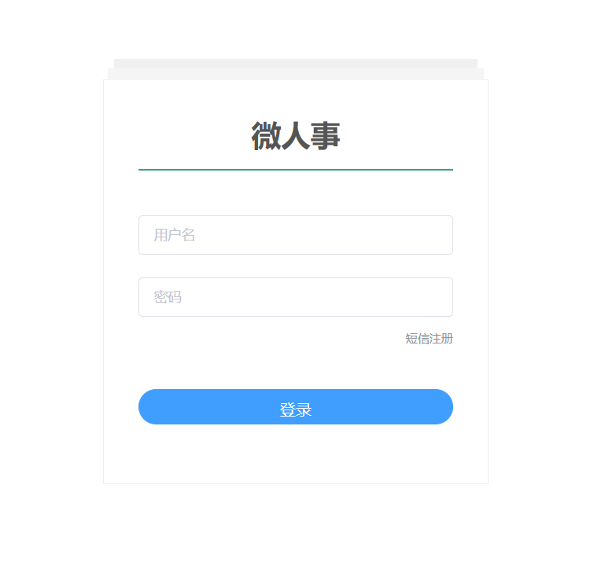
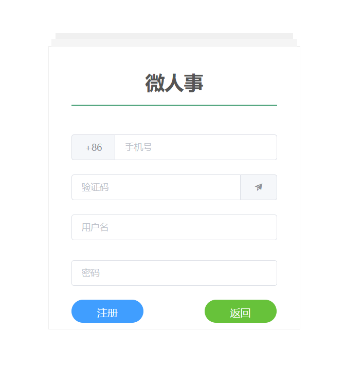
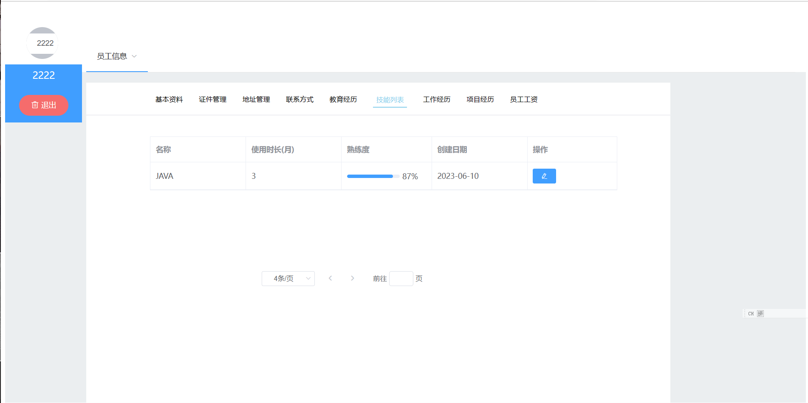
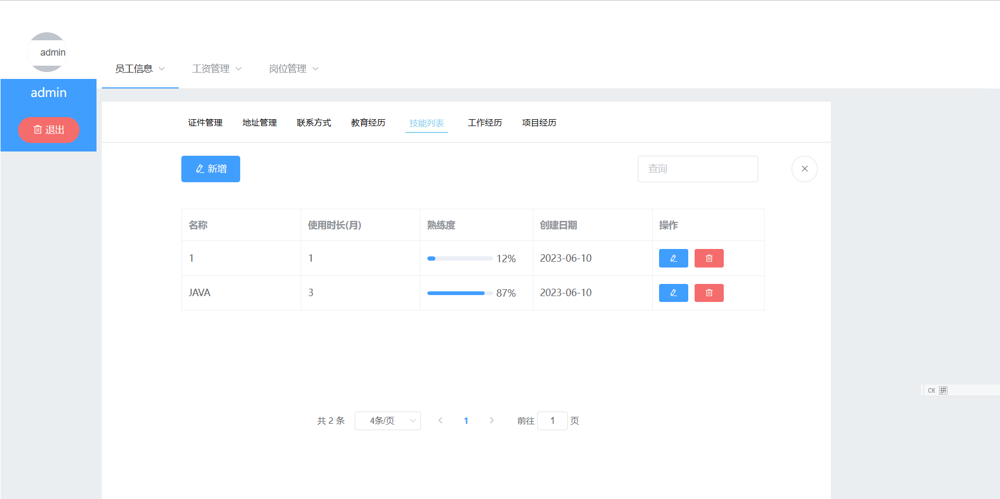

# MicroPersonnel

## 1.1      需求定义

### 1.1.1 需求概述

#### 1 目标

本项目的目标是开发一个功能强大的微型人事管理系统，以提高人力资源管理的效率和准确性。系统将实现管理员和普通用户两种角色，普通用户只能查看和修改个人的信息，其中包括：基本资料、证件信息、地址信息、联系方式、教育经历，技能列表、工作经历、项目经历，同时也能查看个人的工资和岗位。而管理员可以访问和管理所有用户的信息，并具备修改工资和岗位的权限。

 

#### 2 运行环境

1) 硬件环境 window10/window11 pc机
2) 软件环境 idea,vscode

#### 3 用户特点

普通员工：只能查看修改自己的基础信息

系统管理员：可以查看所有人信息，并且可以进行添加,修改和删除操作

 

 

#### 4 关键点

短信注册、判断用户和管理员的权限、路由守卫、前后的分离、接口传输数据

## 2.页面截图

### 2.1登录界面

### 2.2注册界面

短信验证

### 2.3普通用户登录

### 2.4管理员登录

